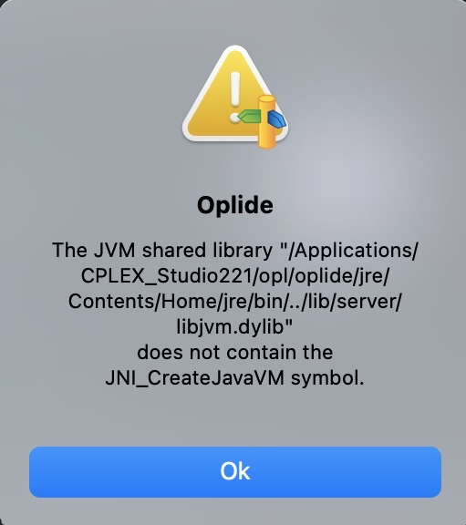

# fiuba-modelos1-lineal-programming
## FIUBA Modelos 1 Lineal Programming

### Commands
```bash
glpsol -m mod1.lp -o mod1.sol
```

### Documentation
https://www.gnu.org/software/glpk/


### Installing CPLEX
TBC

#### Installation error on macOS Monterey

```bash
the JVM shared library
libjvm.dylib
does not cotain the JNI_CreateJavaVM symbol
```
[Solved]
https://stackoverflow.com/questions/25753966/eclipse-jvm-shared-library-does-not-contain-the-jni-createjavavm-symbol

If you are installing eclipse with the Eclipse installer, this can happen when the installer is not pointed to the correct jvm location.
You can correct it as follows.

1. Right click the installer file and select 'show package contents'
2. Go to Contents and open Info.plist
3. At the bottom of this file, you'll see a commented section with the tag <string>-vm</string> with some paths. You can set the correct JAVA_HOME path there and uncomment that section. (running echo $JAVA_HOME in console will get you the current setting)
